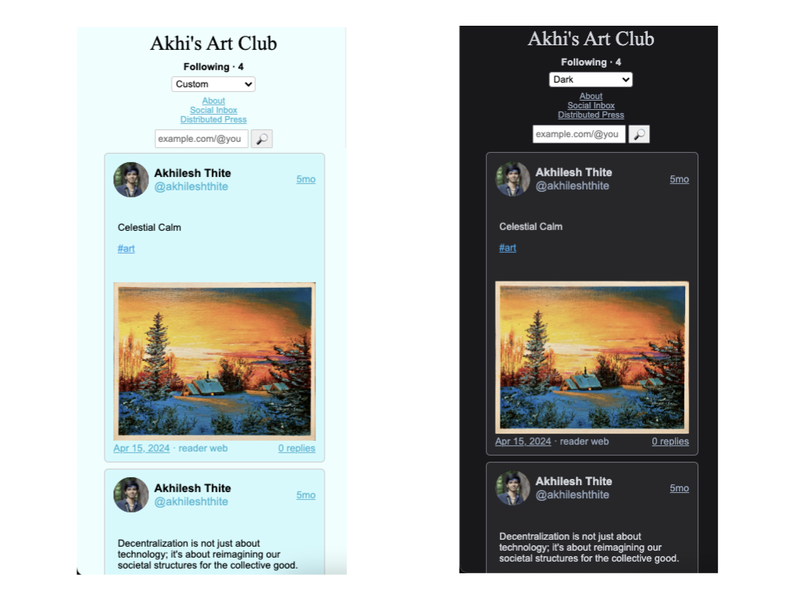

# Social Reader
A P2P and offline-first ActivityPub client for reading and following microblogs on the Fediverse, avoiding dependency on always-online HTTP servers, allowing access to content anytime, anywhere.

## Customizing Your Community's Reader

You can easily deploy a customized version of the reader by [forking](https://github.com/hyphacoop/reader.distributed.press/fork) this repository and modifying the `defaults.json` file located in the `./config` folder. This allows you to set the community name, define a custom theme, and specify the default followed actors for your community.

### Configuration Options:

- `communityName`: The name of your community, which will appear as the page title and sidebar branding.
- `theme`: Customize the appearance of the reader. You can specify:
  - `bgColor`: Background color for the reader.
  - `postBgColor`: Background color for individual posts.
  - `postDetailsColor`: Color for post details (such as date and metadata).
  - `postLinkColor`: Color for links within posts.
- `defaultFollowedActors`: A list of URLs representing the actors that will be followed by default when no actors are followed.

### Example `defaults.json`:

```json
{
  "communityName": "Akhi's Art Club",
  "theme": {
    "bgColor": "#ecfeff",
    "postBgColor": "#cffafe",
    "postDetailsColor": "#06b6d4",
    "postLinkColor": "#0ea5e9"
  },
  "defaultFollowedActors": [
    "https://mastodon.social/@akhileshthite"
  ]
}
```



For more information, please visit [docs.distributed.press](https://docs.distributed.press/social-reader).